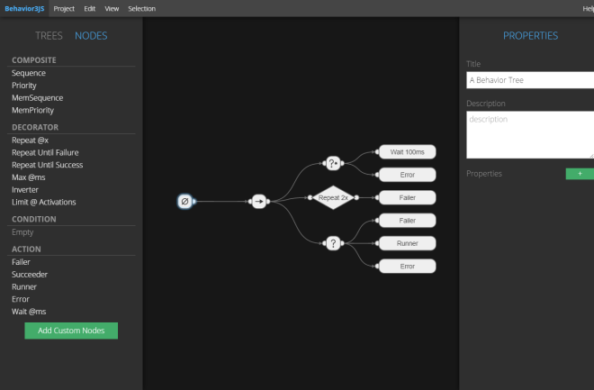

BEHAVIOR3 EDITOR
================

Interested?  | http://behavior3js.guineashots.com/editor | Try it online
-------------|-------------------------------------------|--------------

**Behavior3 Editor** - or simply *b3editor* - is an online visual editor to create Behavior Trees. The b3editor is based on [**Behavior3JS**](http://behavior3js.guineashots.com) implementation, which has a formal and stable basis.

Why should I use Behavior3 Editor?
----------------------------------

Why should you use b3editor? What is different from other editors? Can it compete against commercial alternatives?

Well, check it out some characteristics of Behavior3 Editor:

- **Open Source Software**: under MIT license, you can use this software freely, adapt it to your need and even use a specialized internal version in your company. You can also contribute with bug fixes, suggestions and patches to make it better.

- **Open Format**: b3editor can export the modeled trees to JSON files, following an open format. If there is no official reader on your favorite language yet, you can develop your own library and use the trees created here. 

- **Formality**: the editor works above the basis created by Behavior3JS, which in turn is based on formal description of behavior trees. Thus, the editor provides a stable solution to model agents for your games or other applications such as robotics and simulations in general.

- **Focus on Usability**: intuitiveness is the key word of b3editor. We focus on providing an easy, clean, and intuitive tool for programmers and non-programmers. If there is something obscure or too difficult to use, report it immediately!

- **Minimalist, but Functional**: b3editor follows a minimalist style, trying to reduce the amount of non-essential information presented on the screen. We focus on the important things: designing Behavior Trees. 

- **Customizable**: create your own node types and customize nodes instances individually. Create several projects and trees, change titles and add properties.

- **Big Projects Ahead**: we are working towards a collaborative tool in order to provide an awesome editor for big projects involving several designers working together. 

- **No Install or Depedences**: try it online:

    - http://behavior3js.guineashots.com/editor

If you are interested in the development version, you can access it on:

- http://behavior3js.guineashots.com/editor/dev

Features
--------

- **Custom Nodes**: you can create your own node types inside one of the four basic categories - *composite*, *decorator*, *action* or *condition*. 
- **Individual Node Properties**: you can modify node titles, description and custom properties.
- **Manual and Auto Organization**: organize by dragging nodes around or just type "a" to auto organize the whole tree.
- **Create and Manage Multiple Trees**: you can create and manage an unlimited number of trees.
- **Import and Export to JSON**: export your project, tree or nodes to JSON format. Import them back. Use JSON on your own custom library or tool. You decide.

Limitations
-----------

Nothing is perfect =( . Behavior3 Editor focus on Chrome (thus, working pretty well on Opera too), so it have some incompatibilities with Firefox, such as the image preview lag when dragging to create a node for the first time, and the ugly scroll bar inside the panels.

I did not tested on IE!

Looking for Behavior Tree Libraries?
------------------------------------

For Javascript you can use:

- [Behavior3JS](http://behavior3js.guineashots.com)

*If you have implemented an library compatible with Behavior3 schematics, tell me and I link it here*.

Want to Contribute?
-------------------

Take a look at the issue list, suggest new features, report bugs, send me pull requests, write documentation and tutorials. There are many ways to contribute, do what you know and you can make Behavior3 Editor better!